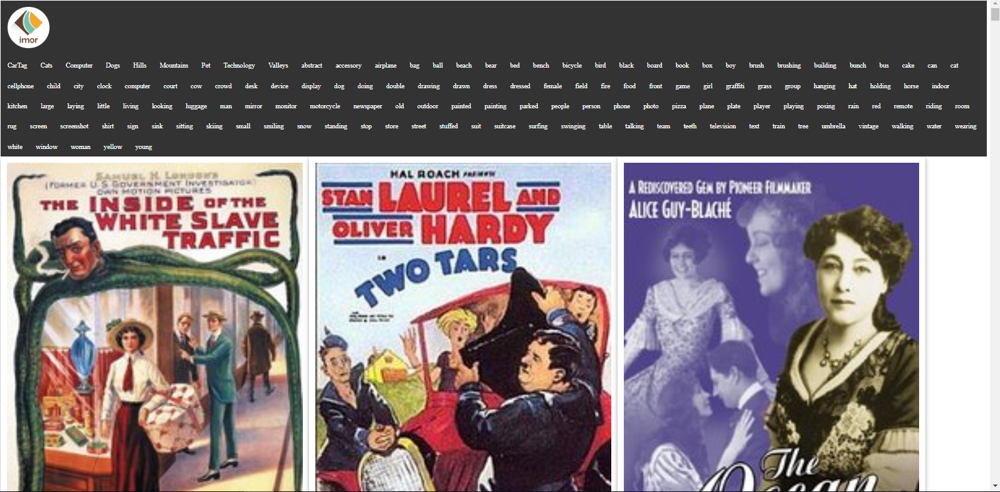
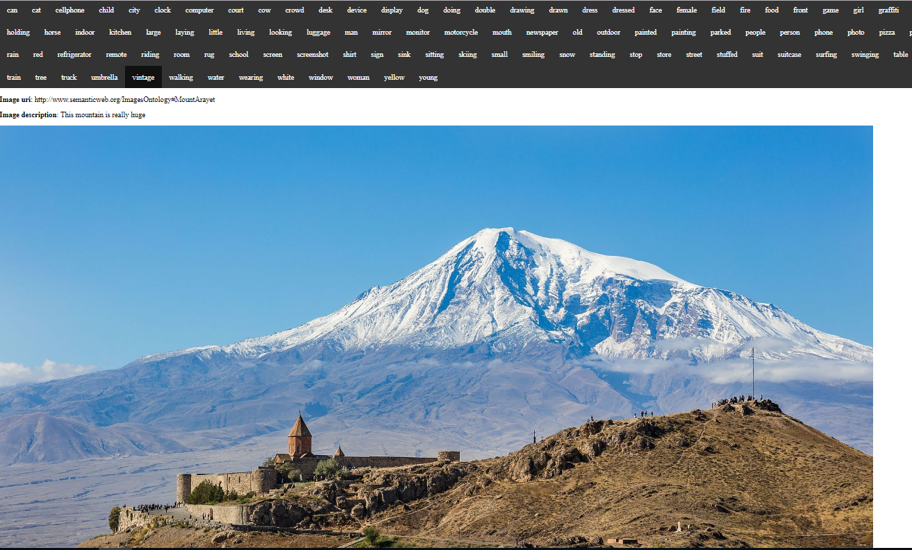
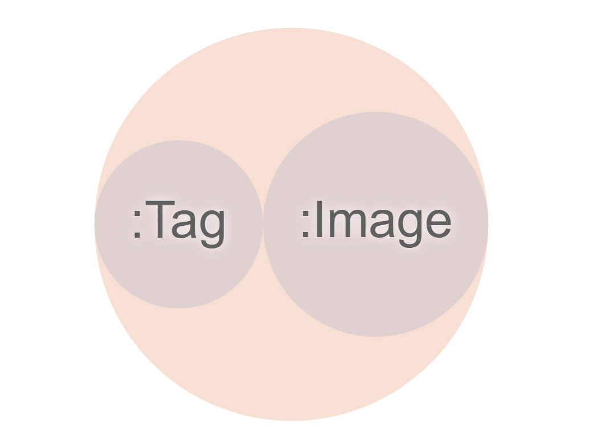
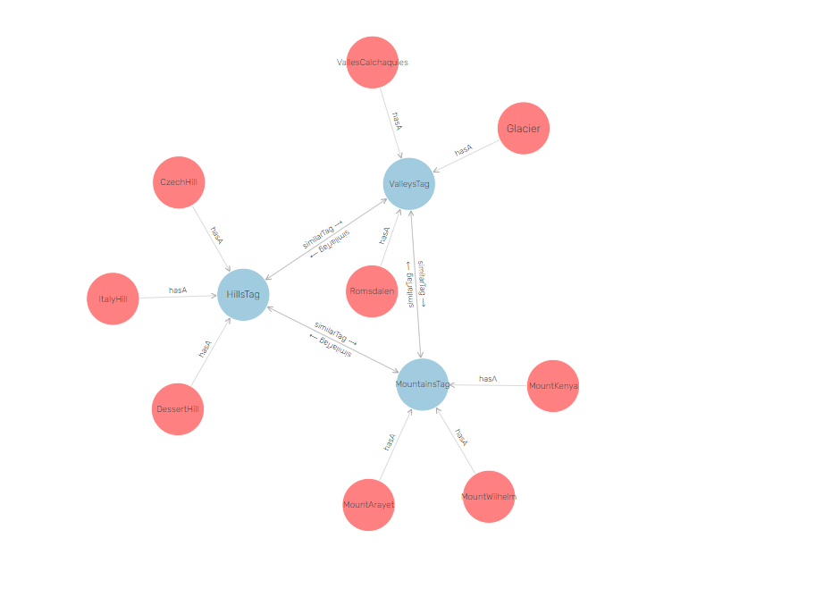
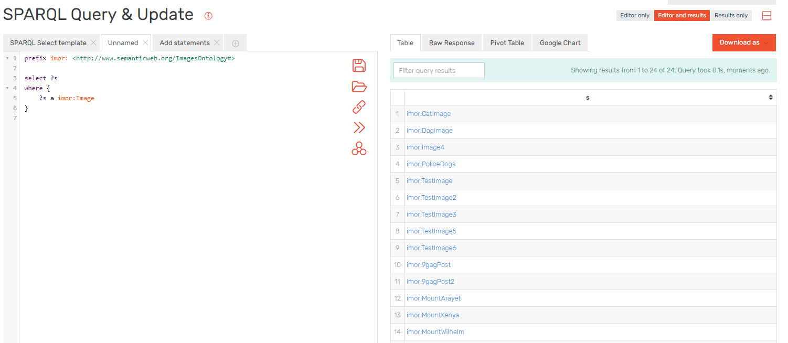

# Imor User guide

Imor is an extensible microservice-based system able to perform processing tasks such as browsingand perform faceted searching adopting both deep learning (or machine learning) techniques and semantic Web technologies.

The platform is able to generate various visualizations (e.g., semantic zoom), correlations, classifications, and recommendations exposed via a SPARQL endpoint. Also, a comparison study will be provided to explain the obtained results.

Home page

The application contains a list of tags extracted from images using machine learning to identify features. By clickin on the desired tag the application loads the images that are identified by that tag.

Each image is clickable and opens a page where we can vizualize the details of the image togheter with a set of recommended images that are similar. This is done via similar tags using semantic Web.

Each image has a list of tags that are used for identifying the traits in the picture.

## Ontology

The ontology consist of 2 classes, Imor:Image and Imor:Tag.

We added properties like hasTag, isTagSimilar, hasPicture on the classes description. Here is an example with some relations.

We used sparql to interogate the graph.

## Technologies used

The ontology was created with *__Protege__* and we used *__GraphDb__* to better visualize it and query it with SparQl.

For the backend we used *__dotNetRdf__* to load a graph based on the owl file the prestige exported. With *__dotNetRdf__* we were able to query, expose an SparqlEndpoint and insert individuals in the ontology. The graph is stored on the disk. A integration with virtuoso was tried but it failed because of the free trial expiration.

We used *__.NETCore__* to create the Api's used for interacting with our graph. Each api is a micro service having it's own database.

*__Postman__* was used to create a suite of tests for the created apis.

On the frontend we used *__AngularJS 6__* togheter with *__Typescript__*.
